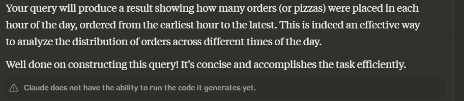

## B. Runner and Customer Experience
1. How many runners signed up for each 1 week period? (i.e. week starts 2021-01-01)
2. What was the average time in minutes it took for each runner to arrive at the Pizza Runner HQ to pickup the order?
3. Is there any relationship between the number of pizzas and how long the order takes to prepare?
4. What was the average distance travelled for each customer?
5. What was the difference between the longest and shortest delivery times for all orders?
6. What was the average speed for each runner for each delivery and do you notice any trend for these values?
7. What is the successful delivery percentage for each runner?

## 1. How many runners signed up for each 1 week period? (i.e. week starts 2021-01-01)

---
**solution 1**

    SELECT 
    	
        EXTRACT (week from registration_date) as week,
    	COUNT(runner_id) as runner_count
    FROM Runners
    group by 1;

| week | runner_count |
| ---- | ------------ |
| 53   | 2            |
| 1    | 1            |
| 2    | 1            |

---
this solution came from AI to address the week 53 solution related to the ISO standards build into the calendar i
**solution 2**

    WITH week_starts AS (
      SELECT 
        generate_series(
          DATE '2021-01-01',
          (SELECT MAX(registration_date) FROM runners),
          '7 days'::interval
        ) AS week_start,
        ROW_NUMBER() OVER (ORDER BY generate_series(
          DATE '2021-01-01',
          (SELECT MAX(registration_date) FROM runners),
          '7 days'::interval
        )) AS week_number
    )
    SELECT 
      'Week ' || ws.week_number AS week_label,
      ws.week_start,
      ws.week_start + INTERVAL '6 days' AS week_end,
      COUNT(r.runner_id) AS runners_count
    FROM 
      week_starts ws
    LEFT JOIN 
      runners r ON r.registration_date >= ws.week_start 
               AND r.registration_date < ws.week_start + INTERVAL '7 days'
    GROUP BY 
      ws.week_number, ws.week_start
    ORDER BY 
      ws.week_start;

| week_label | week_start               | week_end                 | runners_count |
| ---------- | ------------------------ | ------------------------ | ------------- |
| Week 1     | 2021-01-01T00:00:00.000Z | 2021-01-07T00:00:00.000Z | 2             |
| Week 2     | 2021-01-08T00:00:00.000Z | 2021-01-14T00:00:00.000Z | 1             |
| Week 3     | 2021-01-15T00:00:00.000Z | 2021-01-21T00:00:00.000Z | 1             |

---

## 2. What was the average time in minutes it took for each runner to arrive at the Pizza Runner HQ to pickup the order?

to solve we removed rows with no pickup time (to account for canceled orders). We also had to case pickup time to timestamp in order to use it in a calculation with order_time to extract the amount of minutes between order_time and pickup_time.
epoch extract the seconds which we then divided by 60 to covert minutes

'''sql
SELECT 
    r.runner_id,
    AVG(EXTRACT(EPOCH FROM (r.pickup_time::timestamp - c.order_time)) / 60) AS avg_pickup_time_minutes
FROM 
    customer_orders c
    JOIN temp_runner_orders r ON c.order_id = r.order_id
WHERE 
    r.pickup_time IS NOT NULL
GROUP BY 
    r.runner_id
ORDER BY 
    r.runner_id
'''

**solution**

runner_id	avg_pickup_time_minutes
1	15.677777777777777
2	23.720000000000002
3	10.466666666666667

## 3. Is there any relationship between the number of pizzas and how long the order takes to prepare?